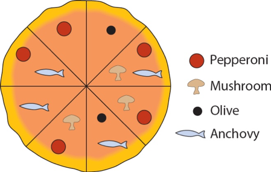

--- 
title: "Exercises for Statistics for Biology - FS 2022"
author: "Stephan Peischl"
output:
  rmdformats::robobook:
    highlight: tango
  pdf_document:
    df_print: kable
    fig_caption: yes
    fig_height: 4
    fig_width: 5
    highlight: tango
    number_sections: yes
    toc: yes
  html_document:
    toc: yes
  tufte::tufte_book: default
  tufte::tufte_handout: default
  tufte::tufte_html: default
  word_document:
    toc: yes
---

```{r,fig.margin = TRUE,fig.align='center',setup, include=FALSE} 
knitr::opts_chunk$set(echo = TRUE) 
``` 

```{r, echo =F} 
library(knitr) 
opts_chunk$set(tidy.opts=list(width.cutoff=50),tidy=FALSE) 
```

```{r ,fig.margin = TRUE,fig.align='center',libraries.eval,echo = F,results='hide', message=F, warning=F}


library(tidyverse) 
library(Rmisc) 
library(tibble) 
library(dplyr)


# here i define a color palette to use as standard when plotting with ggplot
# this is purely for aesthetic reasons

cbp2 <- c("#000000", "#E69F00", "#56B4E9", "#009E73", "#F0E442", "#0072B2", "#D55E00", "#CC79A7")

scale_colour_discrete <- function(...) 
{ scale_colour_manual(..., values = cbp2)
}

```

Solutions to the exercises will be posted [here](https://s-peischl.github.io/StatForBioFS22/Solutions.html) each week after the exercise session. 

[Back to main page.](https://s-peischl.github.io/StatForBioFS22)

# Week 1 (23.02.2022) {.tabset}

## Exercise 1

The peppered moth (Biston betularia) occurs in two types: peppered (speckled black and white) and melanic (black). A researcher wished to measure the proportion of melanic individuals in the peppered moth population in England, to examine how this proportion changed from year to year in the past. To accomplish this, she photographed all the peppered moth specimens available in museums and large private collections and grouped them by the year in which they had been collected. Based on this sample, she calculated the proportion of melanic individuals in every year. The people who collected the specimens, she knew, would prefer to collect whichever type was rarest in any given year, since those would be the most valuable.

a)	Can the specimens from any given year be considered a random sample from the moth population?

b)	If not a random sample, what type of sample is it?

c)	What type of error might be introduced by the sampling method when estimating the proportion of melanic moths?

## Exercise 2 

Which of the following numerical variables are continuous? Which are discrete? (Note: Discrete variables are those that have a finite set of predefined values, whereas continuous variables can take any value within a given interval.)

a)	Number of injuries sustained in a fall

b)	Fraction of birds in a large sample infected with avian flu virus

c)	Number of crimes committed by a randomly sampled individual

d)	Logarithm of body mass

## Exercise 3 

For each of the following studies, say which is the explanatory variable and which is the response variable. Also, say whether the study is observational or experimental.

a)	Forestry researchers wanted to compare the growth rates of trees growing at high altitude to that of trees growing at low altitude. They measured growth rates using the space between tree rings in a set of trees harvested from a natural forest.

b)	Researchers randomly assign diabetes patients to two groups. In the first group, the patients receive a new drug, tasploglutide, whereas patients in the other group receive standard treatment without the new drug. The researchers compared the rate of insulin release in the two groups.

c)	Psychologists tested whether the frequency of illegal drug use differs between people suffering from schizophrenia and those not having the disease. They measured drug use in a group of schizophrenia patients and compared it with that in a similar sized group of randomly chosen people.

d)	Spinner Hansen et al. (2008) studied a species of spider whose females often eat males that are trying to mate with them. The researchers removed a leg from each male spider in one group (to make them weaker and more vulnerable to being eaten) and left the males in another group undamaged. They studied whether survival of males in the two groups differed during courtship.

e)	Bowen et al. (2012) studied the effects of advanced communication therapy for patients whose communication skills had been affected by previous strokes. They randomly assigned two therapies to stroke patients. One group received advanced communication therapy and the other received only social visits without formal therapy. Both groups otherwise received normal, best-practice care. After six months, the communication ability (as measured by a standardized quantitative test score) was measured on all patients.

## Exercise 4 


During World War II, the British Royal Air Force estimated the density of bullet holes on different sections of planes returning to base from aerial sorties (Fig. 1). 
```{r, out.width='90%', fig.align='center', fig.cap='Figure for exercise 4.',fig.margin = TRUE,echo=FALSE}
knitr::include_graphics('AirplaneMissileHits.png')
```
Their goal was to use this information to determine which plane sections most needed additional protective shields. (It was not possible to reinforce the whole plane, because it would weigh too much.) They found that the density of holes was highest on the wings and lowest on the engines and near the cockpit, where the pilot sits (their initial conclusion, that therefore the wings should be reinforced, was later shown to be mistaken). What is the main problem with the sample: bias or large sampling error? What part of the plane should have been reinforced?


## Exercise 5 

An important quantity in conservation biology is the number of plant and animal species inhabiting a given area. To survey the community of small mammals inhabiting Kruger National Park in South Africa, a large series of live traps were placed randomly throughout the park for one week in the main dry season of 2004. Traps were set each evening and checked the following morning. Individuals caught were identified, tagged (so that new captures could be distinguished from recaptures), and released. At the end of the survey, the total number of small mammal species in the park was estimated by the total number of species captured in the survey.

a)	What is the parameter being estimated in the survey?

b) Is the sample of individuals captured in the traps likely to be a random sample? Why or why not? In your answer, address the two criteria that define a sample as random.

c) Is the number of species in the sample likely to be an unbiased estimate of the total number of small mammal species in the park?


\newpage

# Week 2 (02.03.2022)  {.tabset}
In this weeks exercises you can use the following new R commands (use the help function to learn more about them):

```{}
str

dim

ggplot

geom_point

```

If you want to play around with colors, you can define colors using their RGB values:

```{r}
col1 = rgb(255/256, 215/256, 0/256)
col2 = rgb(0/256, 87/256, 183/256)
```


## Exercise 6 
We use the MPG data set introduced in the lecture.  Answer the following questions. You can use base R or ggplot if not otherwise specified.

a)	Run ggplot(data = mpg). 
What do you see?

b)	How many rows are in mpg? How many columns?

c)	What does the drv variable describe? Read the help for ?mpg to find out.

d)	Make a scatterplot of hwy vs cyl.

e)	What happens if you make a scatterplot of class vs drv? Why is the plot not useful?

f)	What is wrong with this code? Why are the points not blue?

```{r,fig.margin = TRUE,fig.align='center', echo = TRUE,results='hide', message=F, warning=F,fig.cap = "Figure for exercise 6 f)."} 

ggplot(data = mpg) + 
  geom_point(mapping = aes(x = displ, y = hwy, color = "blue")) 
```

g)	Map a continuous variable to color, size, and shape. How do these aesthetics behave differently for categorical vs. continuous variables? h)	Fix the following code:

``` 
ggplot(data = mpg) 
  + geom_point(mapping = aes(x = displ, y = hwy)) 
```


\newpage

# Week 3 (09.03.2022)  {.tabset}

New R commands for loading data sets and calculating descriptive statistics (use the help function to learn more about them):

```{}
read.csv

sum

mean

median 

var

sd
```

For plotting you can try:

```{}
geom_histogram

geom_bar

geom_density

geom_boxplot

facet_wrap
```


Accessing variables in a data frame can be done with $ and []:
```{r}
stickleback <- read.csv(url("http://www.zoology.ubc.ca/~schluter/WhitlockSchluter/wp-content/data/chapter03/chap03e3SticklebackPlates.csv"))

stickleback$plates

stickleback$plates[stickleback$genotype=="mm"]

```

More information on how to use these functions can be found here:
https://s-peischl.github.io/StatForBioFS22/#working-with-data-frames


## Exercise 7 
Load the data set "chap04e1HumanGeneLengths.csv" (the lengh of genes in the human genome, found on ilias) and answer the following questions and provide the R code you used for that. Put all of your analysis in a single R script.

a)	How many individuals are in the sample (i.e., what is the sample size, n)? 

b)	What is the sum of all of the observations? 

c)	What is the mean of this sample? 

d)	What is the sum of the squares of the measurements? 

e)	What is the variance of this sample? 

f)	What is the standard deviation of this sample? 

g)	What is the coefficient of variation for this sample? 

h)	Display the data using different plotting techniques. Which one illustrates the data best?


\newpage


# Week 4 (16.03.2022)  {.tabset}

New R commands that can be helpful for this week:

- The for loop repeats a block of code several times. In this example the code in the curly brackets is performed 3 times. The code _i in 1:3_ means that the variable _i_ will take the values 1, 2, and 3 in each iteration: 
```{r}
for (i in 1:3)
{
  print("Value of i:")
  print(i)
}
```

Functions to draw random numbers:

- rnorm 
- rpois
etc.

The first parameter is usually how many realizations you want to draw (the sample size) and the other parameters are the parameters of the distribution from which you are drawing:
```{r}
rnorm(n = 1,mean = 1, sd = 0)
```
This gives you a single realization of a normally distributed random variable with mean 1 and standard deviation 0. 

Functions to get the probability distributions of random variables: 

- dnorm
- dpois 
etc.


## Exercise 8 
Use the stickleback dataset and calculate the median and mean for each genotpye. Make a histogram and add vertical lines to the histogram indicating the mean and median for each genotype. What do you see? How does the shape of the distribution affect differences between mean and median?

## Exercise 9 (standard) 
Copy and paste this R code into a script. Before you run it, try to figure out what it does. Modify the output so that it looks nicer, i.e., add labels, change theme, change colors, ...

Tip 1: Use the help function or the internet to figure out what the different commands and functions are doing.


Tip 2: Look at the next exercise, it may give you an idea what is happening in this R code 


```{r,fig.margin = TRUE,fig.align='center'}

reps = 1000 
sample_size = 10 
mu = 10 
sigma = 5 
means = vector("numeric",reps)

for (i in 1:reps) 
  { 
  sample = rnorm(sample_size,mu,sigma) 
  means[i] = mean(sample)
  }


x = seq(mu-2*sigma,mu+2*sigma,by=0.01)

SE = sigma/sqrt(sample_size)

y = dnorm(x,mu,SE)

df2 = data.frame(x = x,y = y)

df = data.frame(means = means) 
ggplot(data = df) + 
  geom_histogram(aes(x = means),binwidth=1) + 
  geom_line(data = df2,aes(x = x,y = y*reps))

```


## Exercise 9 (challenging) 

Write a short R script that simulates the sampling distribution of the mean. Plot the sampling distribution and add the theoretical expectation to the plot. Follow the following steps:

a)	Choose a distribution that represents your population (e.g., Normal or
Poisson). b)	Draw a sample of n individuals from that population (hint: use
rnorm, rpoiss, etc.. to draw a random sample), and store it in a vector. 
c)	Calculate the mean of the sample. Store the mean of this sample in a vector. 
d)	Do this 1000 times, so that you have calculated a 1000 means from a 1000
samples. Hint: use a for-loop to automate this. e)	Plot a histogram of the
sample means. f)	Add a line for the theoretical expectation of the sampling
distribution. Hint: use the function dnorm to get the density of the normal
distribution.

Tip if you get stuck: Have a look at the previous exercise for inspiration ...


\newpage

\newpage


# Week 5 (23.03.2022)  {.tabset}

## Exercise 10 

The pizza below, ordered from the Venn Pizzeria on Bayes Street, is divided into eight slices.


```{r, out.width='90%', fig.align='center', fig.cap='Pizza for exercise 10.',fig.margin = TRUE,echo=FALSE}

```


Answer the following questions based on the drawing of the pizza:

a)	What is the probability that a randomly drawn slice has pepperoni on it?

b)	What is the probability that a randomly drawn slice has both pepperoni and
anchovies on it?

c)	What is the probability that a randomly drawn slice has either pepperoni  or
anchovies on it?

d)	Are pepperoni and anchovies mutually exclusive on this pizza?

e)	Are olives and mushrooms mutually exclusive on this pizza?

f)	Are getting mushrooms and getting anchovies independent when randomly picking
a slice of pizza?

g)	If I pick a slice from this pizza and tell you that it has olives on it, what
is the chance that it also has anchovies?

h)	If I pick a slice from this pizza and tell you that it has anchovies on it,
what is the chance that it also has olives?

i)	Seven of your friends each choose a slice at random and eat them without
telling you what toppings they had. What is the chance that the last slice has
olives on it?

j)	You choose two slices at random. What is the chance that they have both
olives on them? (Be careful: after removing the first slice, the probability of
choosing one of the remaining slices changes.)

k)	What is the probability that a randomly chosen slice does not have pepperoni
on it?

l) Draw a pizza for which mushrooms, olives, anchovies and pepperoni are all
mutually exclusive


## Exercise 11 
After graduating from your university with a biology degree, you are interviewed for a lucrative job as a snake handler in a circus sideshow. As part of your audition, you must pick up two rattlesnakes from a pit. The pit contains eight snakes, three of which have been defanged and are assumed to be harmless, but the other five are definitely still dangerous. Unfortunately budget cuts have eliminated the herpetology course from the curriculum and so you have no way of telling in advance which snakes are dangerous and which are not. You pick one snake with your left hand and one with your right.


a)	What is the probability that you picked up no dangerous snakes? 

b)	Assume that any dangerous snake that you pick up has a probability of 0.8 of biting you. The defanged snakes do not bite. What is the chance that, in picking up your two snakes, you are bitten at least once? 

c)	If you picked up one snake and it didn't bite you, what is the probability that it is defanged.


## Exercise 12 
Five different researchers independently take a random sample from the same population and calculate a 95% confidence interval for the same parameter.

a)	What is the probability that all five researchers have calculated an interval that includes the true  value of the parameter?

b)	What is the probability that at least one does not include the true parameter value.


\newpage
# Week 6 (30.03.2022)  {.tabset}

## Exercsie 13 
Use the stickleback data set. Calculate a confidence interval for the mean plate numbers for each genotype. Make a plot that shows the mean and the confidence interval of each genotype. Discuss which groups are different and which are not based on your analysis.


## Exercise 14

a) Make a plot of the probability density function of a Normal distribution. Choose values for the mean and variance. Next make a plot of the probability density function of the standard Normal distribution. What do you see? How are these plots different / similar?

b) Draw a random sample (sample size $n = 1000$) from the  Normal distribution that you chose in (a). Plot a histogram of that sample.

c) Combine the two plots in a single plot, i.e., superimpose the probability density function on the histogram.

d) Calculate the 10 percent quantile of the distribution. Store the value in a variable $Q10$. Then calculate the proportion of numbers in your random sample from (b) that are smaller or equal to $Q10$. What do you find?

## Exercise 15 

a) Let $X$ be a random variable that follows the standard normal distribution. Calculate the $p = 0.05,0.1,0.15, ..., 0.95$ percentiles of the standard Normal distribution. Store the values in a vector $Q$. Next calculate the cumulative distribution function for the values in $Q$. Store this in a variable $C$. Finally, plot $p$ against $Q$. What do you see? Can you explain?

b) Plot the probability density function of a Normal distribution. Indicate the smallest 5 percent of the distribution. In other words: Let $X$ be  a normally distributed random variable. For which range $(-\infty,c_1]$ to we get $P(X \leq c_1) = 0.05$?

c) Indicate the most extreme 5 percent of the distribution. In other words: For which range $(-\infty,c_2] \cup [c_2,\infty]$ to we get  $P(X \leq c_2 \text{ or } X \ > c_2 ) = 0.05$?

[Hint: you can use the quantile function of $R$ and the symmetry of the Normal distribution to simplify things]


\newpage
# Week 7 (06.04.2022) {.tabset}
## Exercise 16
Assume that Z is a number randomly chosen from a standard normal distribution. Calculate each of the following probabilities :

a) P(Z > 1.34)

b) P(Z < 1.34)

c) P(Z < 2.15)

d) P(Z < 1.2)

e) P(0.52 < Z < 2.34)

f) P(-2.34 < Z < -0.52)

g) P(Z < -0.93)

h) P(-1.57 < Z < - 0.32)

Make a sketch for each case and calculate the values using R functions.


## Exercise 17 
Use the stickleback data set:

```{r}
stickleback = read.csv("~/Dropbox/Teaching/StatisticsForBiology/chap03e3SticklebackPlates.csv")
```


Remember that you can access different columns in this data frame by using the $ symbol, e.g.:
```{r}
stickleback$genotype
```

If you want to get only specific individuals, e.g. plate number of individuals with a certain genotype, you can use logical operators inside square brackets:

```{r}
stickleback$plates[stickleback$genotype=="mm"]
```


a) Compare the distribution of plate numbers to a normal distribution with the same mean and variance. Do this for each genotype separately. Is it justified do assume a normal distribution?


b) Use the function t.test for each genotype to obtain confidence intervals of the mean plate number for each genotype. Compare this with confidence intervals calculated by hand using the 2 SE approxiamtion. Are the results different? If so, can you explain why?


# Week 8  {.tabset}
## Exercise 18 
Use the data set "chap11e2Stalkies.csv" of  eye span measurements from a sample of stalk-eyed flies:


```{r,fig.margin = TRUE,fig.align='center'} 
dom = "http://www.zoology.ubc.ca/" 
path = "~schluter/WhitlockSchluter/wp-content/data/" 
dat = "chapter11/chap11e2Stalkies.csv" 
location = paste(dom,path,dat,sep="") 
stalkie = read.csv(url(location)) 
```

a) Assume that data is normally distributed.  Transform the data into a standard normally distributed data set. Compare the distribution to a standard normal distribution.


b) Assume that the true mean of the distribution of eye spans is 9 mm. Calculate the t-statistic from the lecture by hand. Check your results using the function t-test.


c) Make a sketch showing the standard normal distribution (or better the student t-distribution) and your observed t-statistics.


d) Can you calculate the probability that you observer a more extreme results than the t-statistic you observed. (That is, the probability P( T > abs(t)) ) + P (T < -abs(t)), where T is a standard normally distributed (or better: use the student t-distribution) random variable and abs(t) is the absolute value of the test statistic you calculated.


\newpage
## Exercise 19

As the world warms, the geographic ranges of species  might shift toward cooler areas. Chen et al. (2011) studied recent changes  in the highest elevation of 31 taxa, in meters, over the late 1900s and early 2000s. Positive numbers indicate upward shifts in elevation, and negative numbers indicate shifts to lower elevations. The values are given by:

```{r,fig.margin = TRUE,tidy=TRUE,fig.align='center'} 
data = c(58.9, 7.8, 108.6, 44.8, 11.1, 19.2, 61.9, 30.5, 12.7, 35.8, 7.4, 39.3, 24.0, 62.1, 24.3, 55.3, 32.7, 65.3, -19.3, 7.6, -5.2, -2.1, 31.0, 69.0, 88.6, 39.5, 20.7, 89.0, 69.0, 64.9, 64.8) 
```

a) What is the sample size n?


b) What is the mean of these data points? Remember to give the units.

c) What is the standard deviation of elevational range shift? (Give the units as
well.)


d) What is the standard error of the mean for these data?


e) Calculate the 95 % confidence interval for the mean using these data.


f) For a hypothesis test, write down the appropriate null and alternative
hypotheses to test whether the elavational shift has changed.


g) Can you come up with a test statistic to test this hypothesis?


h) Do you know the null distribution of this test statistic?


i) Can you describe how to calculate a p-value for this test statistic?


\newpage
# Week 9  {.tabset} 
## Exercise 20  
Perform a goodness-of-fit test for a data set with two categories. The data file is "chap08e4XGeneContent.csv" and can be found on ilias or online:

```{r,fig.margin = TRUE,fig.align='center'} 
dom = "http://www.zoology.ubc.ca/" 
path = "~schluter/WhitlockSchluter/wp-content/data/" 
dat = "chapter08/chap08e4XGeneContent.csv" 
location = paste(dom,path,dat,sep="") 
geneContent <- read.csv(url(location)) 
```

Start by reading and inspecting the data. Each row is a different gene, with its occurrence on the X chromosome indicated.  Then test if the proportion of genes on the X chromosome (among all genes in the genome) is the same as the proportional length of the X chromosome measured in base pairs (among the whole genome). The relative size  of the X chromosome is given by $propX = 1055/20290$ and that of the other chromosomes is $propRest = 19235/20290$.

a) Plot a frequency table showing the number of genes on the X and on other chromosomes.

b) Perform a $\chi^2$ goodness-of-fit test to the proportional model.

c) Draw a conclusion from your test.

## Exercise 21 
Load the dataset chap08e1DayOfBirth.csv:

```{r,fig.margin = TRUE,fig.align='center'} 

dom = "http://www.zoology.ubc.ca/" 
path = "~schluter/WhitlockSchluter/wp-content/data/" 
dat = "chapter08/chap08e1DayOfBirth.csv" 
location = paste(dom,path,dat,sep="") 
birthDay <- read.csv(url(location)) 
head(birthDay) 
``` 
Each row represents a single birth, and shows the day of the week of birth. Test the null hypothesis that birthdays are randomly distributed in the sense that each day occurs with the same probability. Visualize your results and give an interpretation of the test results. Can you come a up with a potential explanation?


# Week 10  {.tabset}

## Exercise 22 

We continue exercise 19 from week 8: As the world warms, the geographic ranges of species  might shift toward cooler areas. Chen et al. (2011) studied recent changes  in the highest elevation of 31 taxa, in meters, over the late 1900s and early 2000s. Positive numbers indicate upward shifts in elevation, and negative numbers indicate shifts to lower elevations. The values
are given by:

```{r,fig.margin = TRUE,fig.align='center',tidy = TRUE} 
data = c(58.9, 7.8, 108.6, 44.8, 11.1, 19.2, 61.9, 30.5, 12.7, 35.8, 7.4, 39.3, 24.0, 62.1, 24.3, 55.3, 32.7, 65.3, -19.3, 7.6, -5.2, -2.1, 31.0, 69.0, 88.6, 39.5, 20.7, 89.0, 69.0, 64.9, 64.8) 
```


j) Perform a one-sample t-test on this data set. Calculate the t-statistics and the P-value for this test as accurately as you can.


k) Interpret your results: Did species change their highest elevation on average? Use a significance threshold of $\alpha = 0.05$.


## Exercise 23

Use the stickleback data set yet again. Perform a t.test for each comparison of plate numbers between genotypes. Compare the outcome of the t.tests with the results from the confidence intervals. What do you find?

\newpage

# Week 11  {.tabset}

## Exercise 24 

A forensic pathologist wants to know whether there is a
difference between the rate of cooling of freshly killed bodies and those which were reheated, to determine whether you can detect an attempt to mislead a coroner about time of death. He tested several mice for their "cooling constant" both when the mouse was originally killed and then after the mouse was re-heated. The data can be found in the file "mouse_cooling.csv" on ilias. Test whether there is any difference in the cooling constants between freshly killed and reheated corpses. Check whether you can use a t-test and justify your decision to use it. If a t-test is not justified, try to use an alternative strategy (e.g., non-parametric test).


## Exercise 25 

For each of the following scenarios, identify the best statistical test to use and state the null hypothesis. (Please note, do not give the answer to the specific question, but simply state the best test to use and the null hypothesis for the scenario.)

a. Asking whether stickleback fish occur with equal probability through all areas of a pond. We have raken random samples at various locations of the pond (all the same size) and have recorded the number of fish in each sampled location.

b) We want to know which of two tumor treatments showed better results. We recorded the change in tumor size during the treatment in two groups of patients, group 1 was treated with drug A and group 2 with drug B.

c) We want to know whether a new tumor treatment showed good results. We recorded the change in tumor size before and after the treatment in each patient.

d) Asking whether the number of smokers in a list of cities is proportional to the population size of those cities.

e) Testing whether patients change in body mass during a hospital stay.

## Exercise 26 

Health spending per person from a randomsample of 20 countries is given in the file "healt_expenditure.csv" on ilias. We will use this sample to estimate the mean of log health expenditure, including a confidence interval.

a) Visualize the frequency distribution using a histogram. Does the data deviate from a normal distribution? If yes, how?

b) Why is a log transformation a good choice for these data?

c) What is the sample size?

d) Calculate the natural logarithm of each data point.

e) What is the mean log health expenditure?

f) What is the standard deviation of the log health expenditure?

g) Calculate the standard error of the mean log health expenditure?

h) Calculate the 95% confidence interval of the mean log health expenditure.

i) What are the limits of this confidence interval expressed on original (non-log) scale?


# Week 12  {.tabset}

## Exercise 27

Recycling paper has some obvious benefits, but it may have unintended  consequences. For example, perhaps people are less careful about how much paper they use if they know their waste will be recycled. Catlin and Wang (2013) tested this idea by measuring paper use in two groups of experimental participants. Each person was placed in a room alone with scissors, paper and a trash can, and was told that he or she was testing the scissors. In the “recycling” group only, there was also a recycling bin in the room. The amount of paper used by each participants was measured in grams.

No recycling bin: 4,4,4,4,4,4,4,5,8,9,9,9,9,12,12,13,14,14,14,14,15,23 

With recycling bin: 4,5,8,8,8,9,9,9,12,14,14,15,16,19,23,28,40,43,129,130

a) Make and examine a histogram of these data. Are the frequency distributions of the two groups similar in shape and spread?

b) Based on (a), discuss your options for testing a difference between the groups.

c) Apply a Mann-Whitney U-test (R function _wilcox.test_). State the null and alternative hypotheses.

d) Calculate the P-value as accurately as you can and interpret the result.

## Exercise 28

Use the data from exercise 26 and perform permutation test on the data. Visualize the empirical sampling distribution and calculate a P-value. (Look up the example of a permutation test in the above notes.) Compare it to the results from the exercise 26.

Alternatively, and easier, take a look at the package: _perm_ and the function _permTS_. The function permTS automatically performs a permutation test for you.

Hints: Calculate the difference of the means: 
```{r,fig.margin = TRUE,fig.align='center'} 

no.recycling = c(4,4,4,4,4,4,4,5,8,9,9,9,9,12,12,13,14,14,14,14,15,23) 
recycling = c(4,5,8,8,8,9,9,9,12,14,14,15,16,19,23,28,40,43,129,130)

n.rec = length(recycling) 
n.no.rec = length(no.recycling)

group = rep(c("Recycling","No.Recycling"),times=c(n.rec,n.no.rec))

dat = data.frame(var = c(recycling,no.recycling),group = group) 
MeanR = mean(no.recycling) 
MeanNR = mean(recycling) 
diffMeans =  MeanNR - MeanR 
```

Calculate difference between means for randomly created groups:
```{r,fig.margin = TRUE,fig.align='center'} 
n = 1000 
permResult <- numeric(n)

permSample <- sample(dat$group, replace = FALSE)

permMeanR <-mean(dat$var[permSample=="Recycling"]) 
permMeanNR <-mean(dat$var[permSample=="No.Recycling"]) 
permResult[1] <- permMeanNR - permMeanR 
```

Now use a loop to calculate many replicates of the random groupings.

\newpage

# Week 13   {.tabset}
## Exercise 29 
Many biological processes display circadian rhythms in activity, which presumably operate to coordinate cellular functions with daily environmental oscillations. Many tissues themselves exhibit circadian rhythms of activity to optimize specific processes which require coordination with the light-dark cycle.  We want to investigate the phase shift in the circadian rhythm of melatonin production in participants given alternative light treatments. Light treatments were applied to the knees or the eyes, as well as a control group without any treatment. The phase shift in the circadian rhythm of melatonin production was recorded.  You can download the data with this command (original publication DOI: 10.1126/science.1071697):

```{r,fig.margin = TRUE,fig.align='center'}
dom = "http://www.zoology.ubc.ca/" 
path = "~schluter/WhitlockSchluter/wp-content/data/" 
dat = "chapter15/chap15e1KneesWhoSayNight.csv" 
location = paste(dom,path,dat,sep="") 
circadian <- read.csv(url(location),stringsAsFactors = FALSE) 
```

a) Visualize the data.

b) Test whether any of the treatments lead to change in the phase shift. Assume that the data is normally distributed (ANOVA!).

c) If the ANOVA tells you that one of the groups is significantly different from the others, find out which one and discuss the results.

d) The original goal of this publication was to replicate findings from an earlier study that showed that light treatment behind the knee can alter your circadian rhythm of melatonin production. The authors replicated the experiment using the same setup and machines, but improved the study design by including a proper control group and using a double-blind experimental design. What did the new study find? Do the new results support the original findings? What can we learn from this?

\newpage


# Week 14  {.tabset}

## Exercise 30

Load the following data set:

```{r,fig.margin = TRUE,fig.align='center'}
dom = "http://www.zoology.ubc.ca/" 
path = "~schluter/WhitlockSchluter/wp-content/data/" 
dat = "chapter17/chap17e1LionNoses.csv" 
location = paste(dom,path,dat,sep="") 
lion <- read.csv(url(location)) 
head(lion) 
```


The data set consists of two mesurements. The age of lions and the proportion of black pigmentation on he nose of the lion.

a) Visualize and inspect the data

b) Calcualte the correlation coefficient of the two variables.

c) Estimate a linear regression model using the data. Inspect the output and write down the model.

d) Check the assumptions of the linear regression.

e) Calculate a confidence interval for the slope of the regression line.

f) Test if the slope of the model significantly different from 0.

g) Plot the data and add a regression line and a confidence band for the  regression line.