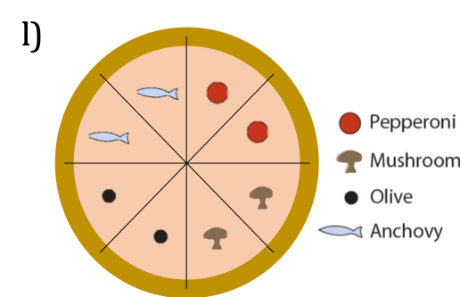

```{r,fig.margin = TRUE,fig.align='center',setup, include=FALSE}
knitr::opts_chunk$set(echo = TRUE)
```

```{r ,fig.margin = TRUE, echo =F} 
library(knitr) 
opts_chunk$set(tidy.opts=list(width.cutoff=50),tidy=FALSE) 
```

```{r ,fig.margin = TRUE,fig.align='center',libraries.eval,echo = F,results='hide', message=F, warning=F}


library(tidyverse) 
library(Rmisc) 
library(tibble) 
library(dplyr)


# here i define a color palette to use as standard when plotting with ggplot
# this is purely for aesthetic reasons

cbp2 <- c("#000000", "#E69F00", "#56B4E9", "#009E73", "#F0E442", "#0072B2", "#D55E00", "#CC79A7")

scale_colour_discrete <- function(...) 
{ scale_colour_manual(..., values = cbp2)
}

```


# Solutions 
Solutions to the exercises will be posted here each week.

[Back to main page.](https://s-peischl.github.io/StatForBioFS22) 
[Back to exercises.](https://s-peischl.github.io/StatForBioFS22/Exercises_web.html)

# Week 1 {.tabset}

## Exercise 1

a) No. Collectors did not choose randomly, but preferred rarer types over more common ones. 

b) It is a sample of convenience.

c) There is bias in every year's sample because rare types are over-represerented. Further this bias might change across years as the frequencies of the two morphs have changed over time.

## Exercise 2	

a)   Discrete.

b)   Technically it is a discrete variable (because fractions can be enumerated / are restricted to finitely many values in a finite sample) but it makes sense to treat it as a continuous variable if the sample is very large. 

c) Discrete. There are no half crimes.

d) Continuous. Body mass is continuous and hence the log as well.


## Exercise  3	

a) E(xplanatory): Altitude (categorical: high vs low)
   R(esponse): Growth rate
   S(tudy type): Observational
   
b) E: Treatment (standard vs. tasploglutide)
   R: Rate of insulin release
   S: Experimental
   
c) E: Health status (schizophrenia vs. healthy)
   R: Frequency of illegal drug use
   S: Observational
   
d) E:Number of legs
   R: Survival propability
   S: Experimental
   
e) E: Treatment (advanced communication therapy vs. social visits without formal therapy)
   R: Communication ability
   S: Experimental

## Exercise  4

The main problem is a strong bias in the sample. To see this, consider the sample of planes that were used in this study. Only planes that were *not* hit in critical areas were available to estimate the distribution of bullet holes. Planes that were hit in a critical area, i.e., one that leads to a crash, were not available because they did not return to base. With this knowledge, it becomes clear that it would have been better to reinforce the areas were no, or very little, bullet holes were found, namely the cockpit and engine. 

## Exercise  5

a) The population parameter being estimated is all the small mammals of Kruger National Park. 

b) No, the sample is not likely to be random. In a random sample, every individual has the same chance of being selected. But some small mammals might be easier to trap than others (for example, trapping only at night might miss all the mammals active only in the day time). In a random sample individuals are selected independently. Multiple animals caught in the same trap might not be independent if they are related or live near one another (this is harder to judge). 

c) The number of species in the sample might underestimate the number in the Park if sampling was not random (e.g., if daytime mammals were missed), or if rare species happened to avoid capture. Even if the sample is perfectly random, the estimator will underestimated the true number in most cases. You can sample fewer species just by chance, but not more species as there actually are. Thus -  on average - you will underestimate the true number.


# Week 2 {.tabset}

## Exercise  6 

a) You should see a blank plot. This is what ggplot does, it simply creates a "canvas" to which you can add "layers".

b) How many rows are in mpg? How many columns?

```{r,fig.margin = TRUE}
str(mpg)
```

There are 234 observations of  11 variables. thus, there are 11 columns and 234 rows. we can confirm this by looking at the dimension of the underlying data matrix:
  
```{r,fig.margin = TRUE}
dim(mpg)
```


c)	

```{r,fig.margin = TRUE}
?mpg
```

drv is a categorical vaiable indicating the drive type:
 f = front-wheel drive, r = rear wheel drive, 4 = 4wd

d)	

```{r,fig.margin = TRUE}
ggplot(data  = mpg) + 
  geom_point(mapping = aes(y = hwy,x = cyl)) + 
  theme_classic() + 
  labs(title = "A scatterplot", y = "miles per gallon on highways",x="cylinders")
```

e)	

```{r,fig.margin = TRUE}
ggplot(data  = mpg) + 
  geom_point(mapping = aes(x = class,y = drv)) + 
  theme_classic() + 
  labs(title = "A useless plot", x = "class",y="drive type")
```
both drv and class are categorical variable and it does not make sense to visualize them this way. What would be a better way to show these data? 


f) Color is used wihtin the aesthetics function, where we specifiy which varibales should be used. "blue" is however not a variable in our data frame. Thus it is ignored. The follwoing code creates the correct plot:

```{r ,fig.margin = TRUE, echo = TRUE,results='hide', message=F, warning=F}
ggplot(data = mpg) + 
  geom_point(mapping = aes(x = displ, y = hwy), color = "blue")
```


g) A continuous variable will lead ot a continuous color gradient rather than a discrete set of colors.
```{r ,fig.margin = TRUE, echo = TRUE,results='hide', message=F, warning=F}
ggplot(data = mpg) + 
  geom_point(mapping = aes(x = cty, y = hwy, color = displ))
```

h) The "+" symbol always has to be in the top row:
  
``` {r,fig.margin = TRUE}
ggplot(data = mpg) + 
  geom_point(mapping = aes(x = displ, y = hwy))
```


```{r, echo = FALSE}
knitr::knit_exit()
```
# Week 3 {.tabset}
## Exercise  7 

````{r,fig.margin = TRUE}
genes <- read.csv(url("http://www.zoology.ubc.ca/~schluter/WhitlockSchluter/wp-content/data/chapter04/chap04e1HumanGeneLengths.csv"))

# a) 

n = dim(genes)[1]
print(n)

# b)	
sum.gene.lengths = sum(genes$geneLength)

# c)	  

mean.gene.length1 = sum.gene.lengths/n
mean.gene.length2 = mean(genes$geneLength)

print(mean.gene.length1)
print(mean.gene.length2)

# d)
square.sum.gene.lengths = sum(genes$geneLength^2)
print(square.sum.gene.lengths)

# e)	

# by hand:
variance.gene.length = sum((genes$geneLength - mean.gene.length1)^2)/(n-1)

print(variance.gene.length)

# for comparison:
var(genes$geneLength)

# f)	
sd(genes$geneLength)

# or 

sd.gene.length = sqrt(variance.gene.length)

# g)	 

cv.gene.length = sd.gene.length/mean.gene.length1
print(cv.gene.length)

# h)	
# Which one do you like best?

ggplot(data = genes) + 
  geom_histogram(mapping = aes(x = geneLength),color="black",fill="darkred") + 
  theme_classic()

ggplot(data = genes) + 
  geom_density(mapping = aes(x = geneLength),color="black",fill="darkred") + 
  xlab("Länge der Gene") +
  ylab("Häufigkeit") +
  scale_x_log10() +
  theme_classic()

ggplot(data = genes) + 
  geom_boxplot(mapping = aes(y = geneLength),color="black",fill="darkred") + 
  theme_classic() + 
  coord_flip()


````


# Week 4 {.tabset}

## Exercise  8


```{r,fig.margin = TRUE}

# load the data file:
stickleback <- read.csv(url("http://www.zoology.ubc.ca/~schluter/WhitlockSchluter/wp-content/data/chapter03/chap03e3SticklebackPlates.csv"))

# one possible solution:

mean.mm = mean(stickleback$plates[stickleback$genotype=="mm"])
mean.mM = mean(stickleback$plates[stickleback$genotype=="Mm"])
mean.MM = mean(stickleback$plates[stickleback$genotype=="MM"])

median.mm = median(stickleback$plates[stickleback$genotype=="mm"])
median.mM = median(stickleback$plates[stickleback$genotype=="Mm"])
median.MM = median(stickleback$plates[stickleback$genotype=="MM"])

par(mfrow = c(1,3))

hist(stickleback$plates[stickleback$genotype=="MM"],
     main = "MM",xlab = "number of plates",
     col="darkred")

abline(v = mean.MM,col="black")
abline(v = median.MM,col="blue")

hist(stickleback$plates[stickleback$genotype=="Mm"],
     main = "Mm",xlab = "number of plates",
     col="darkred")
abline(v = mean.mM,col="black")
abline(v = median.mM,col="blue")

hist(stickleback$plates[stickleback$genotype=="mm"],
     main = "mm",xlab = "number of plates",
     col="darkred")
abline(v = mean.mm,col="black")
abline(v = median.mm,col="blue")


# alternatively, we can first create a data frame 
# with the means per genotype
# check out the help function of ddply
# (this is only one way to do this, you can also do it by 
# "hand" or using other functions such as tapply) :

library(dplyr)
df.mean = ddply(stickleback, "genotype", summarize, m.number = mean(plates))
df.median = ddply(stickleback, "genotype", summarize, m.number = median(plates))

# then we plot it with a single ggplot
ggplot() +
  geom_bar(data = stickleback, mapping = aes(x=plates),binwidth=5,color="black",fill="darkred") +
  geom_vline(data = df.mean, aes(xintercept=m.number),col="black",size=1) +
  geom_vline(data = df.median, aes(xintercept=m.number),col="blue",size = 1) +
  facet_wrap(~ genotype) +
  ylab("frequency") +
  theme_classic()

```


## Exercise  9 
The code simualtes the samplind distirbution of the mean. Here is an alternative version for the Poisson distribution:
```{r,fig.margin = TRUE}
# We choose the Poisson distribution with mean lambda = 50
lambda = 50

# We do 1000 replicates
reps = 1000

# We choose the sample size n to be 10
sample_size = 10

# the means of each sample will be stroed in this vector
means = vector("numeric",reps)

# in this loop, we will calcualte the means of the sample
for (i in 1:reps)
{
  # take a sample of the poisson distribution
  sample = rpois(sample_size,lambda)
  
  # store the mean in our vector
  means[i] = mean(sample)
}

# a histogram - note that we set freq = FALSE to 
# show realtive frequencies 
hist(means,freq=F,main="The sampling distribution of a Poisson distribution")

# we specify the x values for the theoretical poisson
x = seq(0,3*lambda,by=0.1)

#we calcualte the standard error:
SE = sqrt(lambda)/sqrt(sample_size)

# caclualte the corresponding PDF of the poisson
y = dnorm(x,lambda,SE)

lines(x,y)
```


# Week 5 {.tabset}

## Exercise  10
a)	What is the probability that a randomly drawn slice has pepperoni on it?

$$P(pepperoni) = 5/8 = 0.625 = 62.5 \%$$
  
b)	What is the probability that a randomly drawn slice has both pepperoni and anchovies on it?

$$P(pepperoni \quad and \quad anchovies) =   2/8 = 25  \%$$

c)	What is the probability that a randomly drawn slice has either pepperoni  or anchovies on it?


$$P(pepperoni \quad or \quad anchovies) = 7/8 = 0.875 = 87.5\%$$


d)	Are pepperoni and anchovies mutually exclusive on this pizza?

No. There are two slices with both pepperoni and anchovies.


e)	Are olives and mushrooms mutually exclusive on this pizza?

Yes. There is no slice that has both olives and mushrooms on it.


f)	Are getting mushrooms and getting anchovies independent when randomly picking a slice of pizza?


No, because 

$$P(anchovy) = 4/8 = 0.5$$

$$P(mushroom) = 3/8 = 0.375$$

and 

$$P(mushroom \quad and \quad anchovy) = 1/8$$

but 

$$P(mushroom)*P(anchovy) = 3/8 * 4/8 = 3/16 = 0.1875 = 18.75 \% .$$


g)	If I pick a slice from this pizza and tell you that it has olives on it, what is the chance that it also has anchovies?

$$P(anchovy  \mid olive) =$$
$$P(anchovy \quad and \quad olive)/P(olive) = (1/8) / (2/8) = 1/2  = 0.5 = 50\%$$


h)	If I pick a slice from this pizza and tell you that it has anchovies on it, what is the chance that it also has olives?


 $$P(olive  \mid anchovy) =$$
$$P(olive \quad and \quad anchovy)/P(anchovy) = (1/8) / (4/8) = 1/4  = 0.25 = 25\%$$


i)	Seven of your friends each choose a slice at random and eat them without telling you what toppings they had. What is the chance that the last slice has olives on it?

 $$P(last \quad slice \quad has \quad olives) = 2/8 = 0.25 = 25\%$$. 

This can be seen directly because each slice has the same probability to be the last slice.


j)	You choose two slices at random. What is the chance that they have both olives on them? (Be careful: after removing the first slice, the probability of choosing one of the remaining slices changes.)


$$P(first \, slice \,has \, olives) = 2/8$$

$$P(second \, slice \, also \, has \, olives) = 1/7$$

$$P(both \, slices \, have \, olives) = 2/8 * 1/7 = 1/28 \approx 3.6\% $$


k)	What is the probability that a randomly chosen slice does not have pepperoni on it?

$$P(no \, pepperoni) = 1 – P(pepperoni) = 3/8 = 37.5\%$$ 


l) Draw a pizza for which mushrooms, olives, anchovies and pepperoni are all mutually exclusive

 


## Exercise  11
a)	What is the probability that you picked up no dangerous snakes?

$$P(no \, dangerous \, snakes) = $$
$$ P(no  \, dangerous  \, snake \, in  \, left \,  hand)  P(no  \, dangerous  \, snake  \, in \,  right  \, hand)$$
$$= 3/8 * 2/7 = 6/56 = 0.107 = 10.7 \%$$


b)	Assume that any dangerous snake that you pick up has a probability of 0.8 of biting you. The defanged snakes do not bite. What is the chance that, in picking up your two snakes, you are bitten at least once?

$$P(bite) = P(bite  \mid 0 \, dangerous \, snakes) P(0 \,  dangerous \,  snakes)$$
$$+ P(bite  \mid 1 \,  dangerous snakes) P(1 dangerous  \, snakes) $$ 
$$+P(bite  \mid 2 \,  dangerous snakes) P(2 \,  dangerous  \, snakes)$$ 

$$P(0 \,  dangerous  \, snakes) = 0.107$$ (from (a))
$$P(1 \,  dangerous  \, snake) = (5/8  3/7) + (3/8  5/7) = 0.536$$
$$P(2 \,  dangerous  \, snakes) = 5/8 * 4/7 = 0.357$$
$$P(bite  \mid 0 \,  dangerous \,  snakes) = 0$$
$$P(bite  \mid 1  \, dangerous  \, snake) = 0.8$$
$$P(bite  \mid 2  \, dangerous  \, snakes) = 1- P(no  \, bite  \mid 2  \, dangerous  \, snakes) = 1-(1- 0.8)^2 = 0.96$$

Putting al this together: 
$$P(bite) = (0*0.107)+(0.8*0.536)+(0.96*0.357) =  0.772$$


c)	If you picked up one snake and it didn't bite you, what is the probability that it is defanged?
  
  $$P(defanged \mid no \,  bite)= \left[P(no \, bite \mid defanged)P(defanged)\right]/P(no \, bite)$$
    $$P(no  \,  bite  \mid defanged)=1$$
      $$P(defanged) = 3/8$$
        
        $$P(no  \,  bite) = P(defanged)P(no bite  \mid defanged) $$
          $$+ P(dangerous)P(no  \,  bite  \mid dangerous) = (3/8 *1) + (5/8  (1-0.8)) = 0.5$$
            
            Therefore 
          $$P(defanged  \mid no  \,  bite) = (1*3/8 )/ (0.5) = 0.75 = 75\%.$$
            
            
## Exercise  12
            
a)	What is the probability that all five researchers have calculated an interval that includes the true  value of the parameter?
  
  $0.95^5 =  0.774$
    
b)	What is the probability that at least one does not include the true parameter value. 

$1- 0.95^5  = 0.226$
  
  


# Week 6 {.tabset}

## Exercise 13

We first calculate the mean for each genotype:

```{r,fig.margin = TRUE}

stickleback = read.csv("~/Dropbox/Teaching/StatisticsForBiology/chap03e3SticklebackPlates.csv")

mean.mm = mean(stickleback$plates[stickleback$genotype=="mm"])
mean.Mm = mean(stickleback$plates[stickleback$genotype=="Mm"])
mean.MM = mean(stickleback$plates[stickleback$genotype=="MM"])
```

Next the upper and lower limit of the 95% CI using a t-test:
  
```{r,fig.margin = TRUE}
t.t.mm = t.test(stickleback$plates[stickleback$genotype=="mm"])
t.t.Mm = t.test(stickleback$plates[stickleback$genotype=="Mm"])
t.t.MM = t.test(stickleback$plates[stickleback$genotype=="MM"])

CI.mm = t.t.mm$conf.int
CI.Mm = t.t.Mm$conf.int
CI.MM = t.t.MM$conf.int
```

We put it all in a dataframe:

```{r,fig.margin = TRUE}

df = data.frame(means = c(mean.mm,mean.Mm,mean.MM),
                lower = c(CI.mm[1],CI.Mm[1],CI.MM[1]),
                upper = c(CI.mm[2],CI.Mm[2],CI.MM[2]),
                genotypes = c("mm","Mm","MM"))


```

Now we can plot everything:
```{r,fig.margin = TRUE}
ggplot(data = df) +
  geom_errorbar(mapping = aes(x = genotypes,ymin=lower, ymax=upper), width=.1) +
  geom_point(mapping = aes(x = genotypes,y=means)) 
```

If you prefer (I don't) ou can also do a bar plot

```{r,fig.margin = TRUE}
ggplot(data = df) +
  geom_col(mapping = aes(x = genotypes,y=means,fill=genotypes)) +
  geom_errorbar(mapping = aes(x = genotypes,ymin=lower, ymax=upper), width=.1) +
  geom_point(mapping = aes(x = genotypes,y=means))
```

Either way, it is advised to also add the raw data:

```{r,fig.margin = TRUE}
ggplot(data = df)  + 
  geom_jitter(data = stickleback,mapping = aes(x = genotype,y = plates,color=genotype),size=0.8,width=0.05)+
  geom_errorbar(mapping = aes(x = genotypes,ymin=lower, ymax=upper), width=.2) +
  geom_point(mapping = aes(x = genotypes,y=means))

```


## Exercise  14
We first choose values for $\mu$ and $\sigma$ (you can chose any values you want)
```{r,fig.margin = TRUE}
mu = 10
sigma = 2
```

Next we choose the values for the x axis. A good choice is to cover the range from  $\mu - 4 \sigma$ to $\mu + \sigma$. We chose a stepsize of 0.1:
```{r,fig.margin = TRUE}
x = seq(mu-4*sigma,mu+4*sigma,by=0.1)
```

Now we compute the corresponding $y$ values for our plot using the function dnorm:
```{r,fig.margin = TRUE}
y = dnorm(x, mean = mu, sd = sigma)
```

I now do the same thing for the standard normal distribution:
```{r,fig.margin = TRUE}
mu.std = 0
sigma.std = 1
x.std = seq(mu.std-4*sigma.std,mu.std+4*sigma.std,by=0.1)
y.std = dnorm(x.std, mean = 0, sd = 1)
```
And finally we plot both density functions next to each other:
  
```{r,fig.margin = TRUE}

par(mfrow = c(1,2))
plot(x,y,type="l",xlab="x",ylab="density")
plot(x.std,y.std,type="l",xlab="x",ylab="density")
```

We see that both curves look exactly the same. The only difference is the scale of the x and y axes.


b) 


```{r,fig.margin = TRUE}
random.sample = rnorm(1000,mu,sigma)
hist(random.sample,freq=F,ylim=c(0,0.2),breaks=30)
lines(x,y)
```


c) Calculate the 10 percent quantile of the distribution. Store the value in a variable $Q10$. Then calcualte the proportion of numbers in your random sample from (b) that are smaller or equal to $Q10$. What do you find?
  
```{r,fig.margin = TRUE}
Q10 = qnorm(0.1,mean=mu,sd=sigma)
sum(random.sample<=Q10)/1000
```
We find that approximately 10 percent of our random sample is smaller than $Q10$. This is exactly the definition of a quantile!
  
## Exercise  15

a) 

```{r,fig.margin = TRUE}
    
  p = seq(0.05,0.95,by=0.05)
  Q = qnorm(p,mean=0,sd=1)
  C = pnorm(Q,mean=0,sd=1)
  plot(p,C)
```

We find that $p = C$. This means that the cumulative distribution function is the inverse of the quantile function.
  
 
The p-quantile $q_p$ is defined as the number such that  
$$P(X < q_p) = p.$$
We define a quantile function $Q(p) = q_p$.
The cumulative distribution function $F(x)$ gives us the value
$$F(x) = P(X<x)$$
Then 
$F(q_p) = P(X < q_p) = p$
  
and because

$$Q(p) = q_p$$ if follows

that 

$$F(Q(p)) = F(q_p) = p$$
Here is a graphical representation of this relationship

```{r,fig.margin = TRUE}
cdf.std = pnorm(x.std,mean=0,sd=1)
plot(x.std,cdf.std,type="l",xlab="x",ylab = "P(X<x) ")
abline(v=qnorm(0.1,mean=0,sd=1),lwd=2,col="dodgerblue")
abline(h = 0.1,col="slategray",lwd=2)
text(-1.8,0.3,expression(Q[10]),col="dodgerblue")
text(-3.3,0.2,expression(P(X < Q[10])==0.1),col="slategray")
```

b) Indicate the smallest 5 percent of the distribution. In other words: Let $X$ be  a normally distributed random variable. For which range $(-\infty,c_1]$ to we get $P(X \leq c_1) = 0.05$?

  
```{r,fig.margin = TRUE}
mu.std = 0
sigma.std = 1
x.std = seq(mu.std-4*sigma.std,mu.std+4*sigma.std,by=0.1)
y.std = dnorm(x.std, mean = 0, sd = 1)
plot(x.std,y.std,type="l")
c1 = qnorm(0.05,0,1)
abline(v = c1)
```


c) Indicate the most extreme 5 percent of the distribution. In other words: For which range $(-\infty,c_2] \cup [c_2,\infty]$ to we get $P(X \leq c_2 \text{ or } X \ > c_2 ) = 0.05$? [Hint: you can use the quantile function of $R$ and the symmetry of the Normal distribution to simplify things]

```{r,fig.margin = TRUE}
mu.std = 0
sigma.std = 1
x.std = seq(mu.std-4*sigma.std,mu.std+4*sigma.std,by=0.1)
y.std = dnorm(x.std, mean = 0, sd = 1)
plot(x.std,y.std,type="l")
c2 = qnorm(c(0.025,0.975),0,1)
abline(v=c2)
```

We can add some simualted data if we want: 

```{r,fig.margin = TRUE}
set.seed(1984)
n = 1000
random.sample = rnorm(n,0,1)
sum(random.sample < c2[1] | random.sample > c2[2])/n
plot(x.std,y.std,type="l")
rug(random.sample)
rug(random.sample[random.sample < c2[1] | random.sample > c2[2]],col="red")

```

We see that roughly 5 percent fall into the extreme tails of the distribution. this is sensible, because we have defined the extreme part here as the range $(-\infty,c_2] \cup [c_2,\infty]$, where $-c_2$ ($c_2$) is the 2.5 (97.5) percentile of the distribution. 

# Week 7 {.tabset}
## Exercise  16

Remember that pnorm(x) = P(Z < x) and that 1 - pnorm(x) = P(Z > x).

a) P(Z > 1.34)

```{r,fig.margin = TRUE}
x = seq(-4,4,by=0.01)
y = dnorm(x,0,1)
plot(x,y,type="l",xlab="Z",ylab="density")
abline(v = 1.34,col = "red")
text(2.3,0.05,"P(Z > 1.34)")
prob = 1 - pnorm(1.34,0,1)
prob
```

b) P(Z < 1.34)

```{r,fig.margin = TRUE}
plot(x,y,type="l",xlab="Z",ylab="density")
abline(v = 1.34,col = "red")
text(0,0.05,"P(Z < 1.34)")
prob = pnorm(1.34,0,1)
prob
```

c) P(Z < 2.15)

```{r,fig.margin = TRUE}
plot(x,y,type="l",xlab="Z",ylab="density")
abline(v = 2.15,col = "red")
text(0,0.05,"P(Z < 2.15)")
prob = pnorm(2.15,0,1)
prob
```

d) P(Z < 1.2)

```{r,fig.margin = TRUE}
plot(x,y,type="l",xlab="Z",ylab="density")
abline(v = 1.2,col = "red")
text(0,0.05,"P(Z < 1.2)")
prob = pnorm(1.2,0,1)
prob
```

e) P(0.52 < Z < 2.34)

```{r,fig.margin = TRUE}
plot(x,y,type="l",xlab="Z",ylab="density")
abline(v = 2.34,col = "red")
abline(v = 0.52,col = "red")

text(1.5,0.3,"P(0.52 < 
Z < 
2.34)")
prob = pnorm(2.34,0,1) - pnorm(0.52,0,1)
prob
```

f) P(-2.34 < Z < -0.52)

```{r,fig.margin = TRUE}
plot(x,y,type="l",xlab="Z",ylab="density")
abline(v = -2.34,col = "red")
abline(v = -0.52,col = "red")

text(-1.5,0.3,"P(0.52 < 
Z < 
2.34)")
prob = pnorm(-0.52,0,1) - pnorm(-2.34,0,1) 
prob
```

g) P(Z < -0.93)

```{r,fig.margin = TRUE}
plot(x,y,type="l",xlab="Z",ylab="density")
abline(v = -0.93,col = "red")

text(-2,0.3,"P(Z < -0.93)")
prob = pnorm(-0.93,0,1) 
prob
```

h) P(-1.57 < Z < - 0.32)

```{r,fig.margin = TRUE}
plot(x,y,type="l",xlab="Z",ylab="density")
abline(v = -1.57,col = "red")
abline(v = - 0.32,col = "red")

text(-1.5,0.3,"P(-1.57 < 
Z < 
- 0.32)")
prob = pnorm(-0.32,0,1) - pnorm(-1.57,0,1) 
prob
```

## Exercise  17
a)

We first calculate the mean for each genotype:

```{r,fig.margin = TRUE}

stickleback = read.csv("~/Dropbox/Teaching/StatisticsForBiology/chap03e3SticklebackPlates.csv")

mean.mm = mean(stickleback$plates[stickleback$genotype=="mm"])
mean.Mm = mean(stickleback$plates[stickleback$genotype=="Mm"])
mean.MM = mean(stickleback$plates[stickleback$genotype=="MM"])
```

Next we do teh same thing for the standard deviation:
```{r}
sd.mm = sd(stickleback$plates[stickleback$genotype=="mm"])
sd.Mm = sd(stickleback$plates[stickleback$genotype=="Mm"])
sd.MM = sd(stickleback$plates[stickleback$genotype=="MM"])
```

And now we can make 3 plots, one fore each case:

```{r}
x = seq(0,100,by = 0.01)

hist(stickleback$plates[stickleback$genotype=="mm"],freq=F,
     main =  "Genotype: mm",xlab = "Plates",ylab  = "Frequency ")
y = dnorm(x,mean.mm,sd.mm)
lines(x,y,lwd=2,col="red")
```
```{r}
hist(stickleback$plates[stickleback$genotype=="Mm"],freq=F,
     main =  "Genotype: Mm",xlab = "Plates",ylab  = "Frequency ",
     xlim=c(0,100))
y = dnorm(x,mean.Mm,sd.Mm)
lines(x,y,lwd=2,col="red")
```
```{r}
hist(stickleback$plates[stickleback$genotype=="MM"],freq=F,
     main =  "Genotype: MM",xlab = "Plates",ylab  = "Frequency ",
     xlim=c(0,100))
y = dnorm(x,mean.MM,sd.MM)
lines(x,y,lwd=2,col="red")
```

It can be seen clearly from the images that the normal distribution is not a very good approximation to reality in this case. In particular for heterozygotes.

b)
We use the function t.test to calculate the upper and lower limit of the 95% CI:
  
```{r,fig.margin = TRUE}
t.t.mm = t.test(stickleback$plates[stickleback$genotype=="mm"])
t.t.Mm = t.test(stickleback$plates[stickleback$genotype=="Mm"])
t.t.MM = t.test(stickleback$plates[stickleback$genotype=="MM"])

CI.mm = t.t.mm$conf.int
CI.Mm = t.t.Mm$conf.int
CI.MM = t.t.MM$conf.int
```

We put it all in a dataframe to make comparison easier:

```{r,fig.margin = TRUE}

df = data.frame(means = c(mean.mm,mean.Mm,mean.MM),
                lower = c(CI.mm[1],CI.Mm[1],CI.MM[1]),
                upper = c(CI.mm[2],CI.Mm[2],CI.MM[2]),
                genotypes = c("mm","Mm","MM"))


```


Now we calculate the standard error of the mean for each genotype. We can use the standard deviation we have calculated in (a) for this. First we need the sample size for each group:

```{r}
n.mm = length(stickleback$genotype=="mm")
n.Mm = length(stickleback$genotype=="Mm")
n.MM = length(stickleback$genotype=="MM")
```

Then we can directly calculate the standard error:

```{r}
SE.mm = sd.mm/(sqrt(n.mm))
SE.Mm = sd.mm/(sqrt(n.Mm))
SE.MM = sd.mm/(sqrt(n.MM))
```


Adding the results to the data frame:
```{r,fig.margin = TRUE}

lower.approx = c(mean.mm-2*SE.mm,mean.Mm-2*SE.Mm,mean.MM-2*SE.MM)
upper.approx = c(mean.mm+2*SE.mm,mean.Mm+2*SE.Mm,mean.MM+2*SE.MM)

df.2 = mutate(df, lower.2SE = lower.approx,
              upper.2SE = upper.approx)

print(df.2)

```

We can see that the values are similar but that the 2 SE method gives us narrower confidence intervals. This is due to the small sample size so that the sampling distribution looks more like t distribution than a normal distribution. 


# Week 8 {.tabset}

## Exercise  18

```{r,fig.margin = TRUE}
geneContent <- read.csv(url("http://whitlockschluter.zoology.ubc.ca/wp-content/data/chapter08/chap08e4XGeneContent.csv"))

propX = 1055/20290

propAut = 19235/20290

head(geneContent)


geneContent$chromosome <- factor(geneContent$chromosome, levels = c("X","NotX"))


geneContentTable <- table(geneContent$chromosome)

barplot(geneContentTable)

ggplot(geneContent) + 
  geom_bar(mapping = aes(x = chromosome))

chisq.test( geneContentTable, p =  c(propX,propAut))
```

Intepretation:

Our tests shows that there is a very small $p-value$ indicating that the null hypothesis

$H_0:$ The proportion of genes on the X-chromomose is the same as the proportion of base pairs on the X-Chromosome. 

can be rejected in favor of the alternative hypothesis

$H_A:$ The proportion of genes on the X-chromomose is not the same as the proportion of base pairs on the X-Chromosome. 


## Exercise  19
```{r,fig.margin = TRUE}
birthDay <- read.csv(url("http://whitlockschluter.zoology.ubc.ca/wp-content/data/chapter08/chap08e1DayOfBirth.csv"))
head(birthDay)
```

Put the days of the week in the correct order for tables and graphs.
```{r,fig.margin = TRUE}
birthDay$day <- factor(birthDay$day, levels = c( "Monday",
 	"Tuesday", "Wednesday","Thursday","Friday","Saturday","Sunday"))

birthDayTable <- table(birthDay$day)
data.frame(Frequency = addmargins(birthDayTable))
```
Bar graph of the birth data. The argument cex.names = 0.8 shrinks the names of the weekdays to 80\% of the default size so that they fit in the graphics window -- otherwise one or more names may be dropped.
```{r,fig.margin = TRUE}
barplot(birthDayTable, cex.names = 0.8)
shortNames = substr(names(birthDayTable), 1, 3)
barplot(table(birthDay$day), names = shortNames,
ylab = "Frequency", las = 1, col = "firebrick")

```

$\chi^2$ goodness-of-fit test. The vector p is the expected proportions rather than the expected frequencies, and they must sum to 1 (R nevertheless uses the expected frequencies when calculating the test statistic). 

```{r,fig.margin = TRUE}
chisq.test(birthDayTable, p = rep(1/7,times=7))
```
We find a small $p-value$ (< 0.05) so we can rejected the null hypothesis 

$H_0: $ birthdays are uniformly distributed across weekdays.
 
in favor of the alternative hypothesis

$H_A: $ birthdays are not uniformly distributed across weekdays.

From inspecting tha data, it appears as if births are less common on Sundays. It could be that scheduled caesarean deliveries are not scheduled on weekends. Another reason could be that hospitals may sometimes be understaffed on weekends and hence there might be a tendency to wait a bit longer with inducing labor in some non-critical cases.

Note, however, that the p-value is not extremely small. We would reject the null hypothesis if we choose $\alpha = 0.05$ but not if we chosse $\alpha = 0.01$. This illustrates that your choice of rejecting or not rejecting a null hypothesis is strongly influenced by the degree of certainty you want to have in your decision. 


# Week 9 


## Exercise  20


```{r,fig.margin = TRUE}
stalkie <- read.csv(url("http://www.zoology.ubc.ca/~schluter/WhitlockSchluter/wp-content/data/chapter11/chap11e2Stalkies.csv"))


m0 = 9
M <- mean(stalkie$eyespan)
n <- length(stalkie$eyespan)
sigma <- sd(stalkie$eyespan)
SE <- sigma / sqrt(n)
test.statistic <- (M - m0) / SE

p.value = 2 * pt(-abs(test.statistic),df=8)
print(p.value)

x=seq(-4,4,by=0.01)
y = dt(x,df=8)
plot(x,y,type="l")

abline(v = test.statistic,col="dodgerblue")
text(-3,0.2,"test statistic",col="dodgerblue")
text(2,0.3,"t-distribution, 
     with 8 degrees of freedom")

x1 = seq(-4,test.statistic,by=0.01)
y1 = dt(x1,df=8)

x2 = rev(x1)
y2 = y1*0

polygon(c(x1,x2),c(y1,y2),col = "red")
polygon(-c(x1,x2),c(y1,y2),col = "red")
text(-3.5,0.05,"P value",col="red")

```

The p value of the t-test is
```{r,fig.margin = TRUE}
test = t.test(stalkie$eyespan-9)

print(test$p.value)
```
and the test statistic is
```{r,fig.margin = TRUE}
print(test$statistic)
```

We can summarize this in a table:
```{r,fig.margin = TRUE}
dat = data.frame(pValues = c(p.value,test$p.value),tStatistics = c(test.statistic,test$statistic))
colnames(dat) = c("P Value","Test Statistic")
rownames(dat) = c("by hand","using t.test()")
kableExtra::kable(dat) 
```


## Exercise  21

```{r,fig.margin = TRUE}
data = c(58.9, 7.8, 108.6, 44.8, 11.1, 19.2, 61.9, 30.5, 12.7, 35.8, 7.4, 39.3, 24.0, 62.1, 24.3, 55.3, 32.7, 65.3, -19.3, 7.6, -5.2, -2.1, 31.0, 69.0, 88.6, 39.5, 20.7, 89.0, 69.0, 64.9, 64.8)
```

a) What is the sample size n?

```{r,fig.margin = TRUE}
n = length(data)

print(paste("The sample size is ",n))
```

b) What is the mean of these data points? Remember to give the units.

```{r,fig.margin = TRUE}
m = mean(data)

print(paste("The mean shift is ",m, "meters."))
```

c) What is the standard deviation of elevational range shift? (Give the units 
as well.)

```{r,fig.margin = TRUE}
sd = sd(data)

print(paste("The staandard deviation of the shift is ",round(sd,digits=2)," meters."))
```


d) What is the standard error of the mean for these data?

```{r,fig.margin = TRUE}
SE = sd/sqrt(n)

print(paste("The standard error of the mean is ",round(SE,digits=2),"."))
```

e) How many degrees of freedom will be associated with a confidence interval and a one-sample t-test for the mean elevation shift?

There are 30 (= $n-1$) degrees of freedom.

We can check with the t.test() function:
```{r,fig.margin = TRUE}
tt = t.test(data)
tt
```

f) Calculate the 95 % confidence interval for the mean using these data.

We can either use our results from the t-test before:

```{r,fig.margin = TRUE}
tt$conf.int
```

or 
```{r,fig.margin = TRUE}
upper = m + 2*SE
lower = m - 2*SE

c(lower,upper)
```

A more precise version:
```{r,fig.margin = TRUE}
upper = m + qt(0.975,df = n - 1)*SE
lower = m + qt(0.025,df = n - 1)*SE
c(lower,upper)
```


g) For the one-sample t-test, write down the appropriate null and alternative hypotheses.

$H_0:$ The mean elevational shift is 0 meters.
$H_A:$ The mean elevational shift is not 0 meters. 

h) Calculate the test statistic t for this test.

We canu again just use t.test():
```{r,fig.margin = TRUE}
tt$statistic
```


or do it by hand:

```{r,fig.margin = TRUE}
mu.0 = 0 # as specified in the null hypothesis
t.stat = (m - mu.0)/SE
t.stat 
```
i) What assumptions are necessary to do a one-sample t-test?

The data should be approximately normally distributed. We can check this with a histogram

```{r,fig.margin = TRUE}
hist(data)
```

A slightly more precise way would be to do a QQ plot
```{r,fig.margin = TRUE}
library(car)
qqPlot(data)
```

As long as the points are within the dashed lines, you can safely do a t-test. 

# Week 10
## Exercise 22
j) Calculate the P-value for this test as accurately as you can.

The most accurate way is either to use t-test again
```{r,fig.margin = TRUE}
tt$p.value
```

We can also do it by hand. For this it is good to make a sketch first:
```{r,fig.margin = TRUE}
# we first calcualte the null distirbution of our t statisitc
x = seq(-8,8,by=0.01)
y = dt(x,df = n-1)

# and plot it
plot(x,y,type="l",xlab="t",ylab="density")

# we add the observed t statistic
abline(v = t.stat,col="slategray")
```
We see in the figure that the observed t statistic is far away from the mode of the t distribution. The p value shoul dtherfroe be very small. To calcualte it, we calcualte the area under the curve to the right of the statistic, and double this value to account for extreme events on the left end of the distirbution (we perform a two-sided test). The function pt would give us the area to the left of the test statistic, so we use 2*(1-pt(t.stat,df = n-1)) to get the p-value:

```{r,fig.margin = TRUE}
2*(1-pt(t.stat,df = n-1))
```

k) Did species change their highest elevation on average?

We choose a signifcance threshold of 5 percent, i.e., we want to be 95 percent certain that we do not have a false positive. Th p-value is clearly smaller than that. Thus, the t-test  shows that there is a statistically significant change in the highest elevation. Because the p-value is so small, we can be very certain of this result as it would alos hold at much lower signifcance thresholds. 


## Exercise  23


Previously we used a one sample t-test to calculate the confidence intervals. This test also tested the null hypothesis that the means of each group are 0. If we want to compare means between groups we need to do a two sample t-test:

```{r,fig.margin = TRUE}
t.test(stickleback$plates[stickleback$genotype=="mm"],
       stickleback$plates[stickleback$genotype=="Mm"])

t.test(stickleback$plates[stickleback$genotype=="mm"],
       stickleback$plates[stickleback$genotype=="MM"])

t.test(stickleback$plates[stickleback$genotype=="Mm"],
       stickleback$plates[stickleback$genotype=="MM"])

```

We find that all t-test yield a significant result (small p values). This means that the null hypothesis of the mean of two groups being the same can be rejected for all comparisons. 

A shorter way is by using the function pairwise.t.tests. The First argument is the variable on which the t-test should be performed. The second parameters is the grouping factor: the categorical variable that separates the first argument into different groups.

```{r,fig.margin = TRUE}
 pairwise.t.test(stickleback$plates,stickleback$genotype)
```

How does this finding relate to the confidence intervals? The confidence intervals are not overlapping, strongly suggesting that the means between groups are indeed different (at the 95 percent level). Thus, the t-test and the confidence interval indicate the same result.


# Week 11

## Exercise  24

```{r,fig.margin = TRUE}


mouse_cooling <- read.csv("~/Dropbox/Teaching/StatisticsForBiology/mouse_cooling.csv")

mouse_cooling = mutate(mouse_cooling,diff = freshly.killed - reheated)   
ggplot(mouse_cooling) + 
  geom_histogram(aes(x = diff),bins=7)

```

The data is clearly right skewed. This can also be seen with a QQ plot:
```{r,fig.margin = TRUE}
library(car)
qqPlot(mouse_cooling$diff)
```
The null hypothesis is 

$H_0:$ The true mean of the differences is $\mu_0 = 0$.

We try the following log transformation: $x' = log(100,100+x)$. Note that we add a constant so that we do not get negative values and then use the base 100 logarithm. The new value of our null hpyothesis is then $\mu_0' = 1$ because $x' = log(100,100+x)$ and therefore $\mu_0' = log(100,100 + \mu_0) = 1$.
```{r,fig.margin = TRUE}
library(car)
qqPlot(log(100,100+mouse_cooling$diff))
ggplot(mouse_cooling) + 
  geom_histogram(aes(x = log(100,100+diff)),bins=7)

```
This looks much better now and we perform a t-test on these data:
```{r,fig.margin = TRUE}
results = t.test(log(100,100+mouse_cooling$diff),mu = 1)
results

```

An alternative would be the sign test:
```{r,fig.margin = TRUE}
k = sum(mouse_cooling$diff<0)
results.sign = binom.test(k,n=19,p=0.5)
results.sign
```
In both cases we find no significant devation from 0 in the differnces. We thus cannot reject the null hypothesis. 


## Exercise  25


a) $\chi^2$ Goodness of fit test
H0: Fish numbers per unit area follow a Poisson distribution.

b) Two sample t-test or a non-parametric alternative.
H0: There is no difference in the mean tumor size change in the two groups.

c) One sample t-test or a non-parametric alternative.
H0: Themean tumor size change durign the treatment is 0.

d) $\chi^2$ Goodness-of-fit test
H0: The number of smokers in a city is proportional to the number of people in that city.

e) One-sample t-test
H0: Mean change in patient body mass during hospital stay is zero.


## Exercise  26


```{r,fig.margin = TRUE}
health.expenditure <- read.csv("~/Dropbox/Teaching/StatisticsForBiology/health_expenditure.csv")
```

a) 


```{r,fig.margin = TRUE}
ggplot(health.expenditure) +
  geom_histogram(aes(x = Per.capita.health.expenditure.in.2010),bins=10)
```

b) 

Becaue it is highly right skewed.

c) 
The sample size is
```{r,fig.margin = TRUE}
n = dim(health.expenditure)[1]
n
```


d) Calculate the natural logarithm of each data point.

```{r,fig.margin = TRUE}
data = mutate(health.expenditure,log.expend=  log(Per.capita.health.expenditure.in.2010))
data$log.expend
ggplot(data) +
  geom_histogram(aes(x = log.expend),bins=4)

qqPlot(data$log.expend)
```

e) 
The mean is
```{r,fig.margin = TRUE}
 M =mean(data$log.expend)
M
```

f) 
The standard deviation is
```{r,fig.margin = TRUE}
SD = sd(data$log.expend)
SD
```

g) 

The standard error is
```{r,fig.margin = TRUE}
SE = SD/sqrt(n)
SE
```

h) 

```{r,fig.margin = TRUE}
CI.log = t.test(data$log.expend)$conf.int
CI.log
```

or alterantively we can approximate it by:

```{r,fig.margin = TRUE}
CI.log.app = c(M-2*SE,M+2*SE)
CI.log.app
```

i) 
```{r,fig.margin = TRUE}
CI.nonlog = exp(CI.log)
CI.nonlog
M.nonlog = mean(data$Per.capita.health.expenditure.in.2010)
hist(data$Per.capita.health.expenditure.in.2010,col="firebrick",main="",breaks=10)
abline(v = CI.nonlog,lty=2)
abline(v = M.nonlog,lwd=2)
```
Note how asymmetric the back transformed CI is - this reflects the asymmetry of the data. Be careful however, as this is an approximation! (Note: mean of logarithm transformed data is not the same as the logarithm of the mean of the data).


# Week 12
## Exercise  27

a) 
```{r,fig.margin = TRUE}
no.recycling = c(4,4,4,4,4,4,4,5,8,9,9,9,9,12,12,13,14,14,14,14,15,23)
recycling = c(4,5,8,8,8,9,9,9,12,14,14,15,16,19,23,28,40,43,129,130)

n.rec = length(recycling)
n.no.rec = length(no.recycling)

group = rep(c("Recycling","No.Recycling"),times=c(n.rec,n.no.rec))

dat = data.frame(var = c(recycling,no.recycling),group = group)

ggplot(dat) + 
  geom_histogram(aes(x = var,fill=group))

ggplot(dat) + 
  geom_histogram(aes(x = var,fill = group),bins=12) + 
  facet_wrap(~group,nrow=2) 
```
Both shape and spread seem to be different here, altough it is diffcult to tell based on the small sample sice. A Normal Distribution can however be ruled out, especially fro the _recycling group_.
```{r,fig.margin = TRUE}
ggplot(dat) + 
  geom_qq(aes(sample = var,col=group)) + 
  geom_qq_line(aes(sample = var,col=group))+ 
  facet_wrap(~group,nrow=2) 

qqPlot(recycling)
qqPlot(no.recycling)
```
b) A t-test should not be used. Based on the small sample size, a permutation test will not work well (see exercise 27). We opt for a Man-Whitney U test.

c and d) 

$H_0:$ It is equally likely that a randomly selected value from one group will be less than or greater than a randomly selected value from a second population.
$H_A:$ It is not equally likely that a randomly selected value from one group will be less than or greater than a randomly selected value from a second population.


```{r,fig.margin = TRUE}
wilcox.test(var~group,data=dat)

# alternative without dataframes
wilcox.test(recycling,no.recycling)
```

For comparison, a t-test in this case would yield (not taht the t-test uses a different null hypothesis ):
```{r,fig.margin = TRUE}
t.test(var~group,data=dat)
```
Both test actually give similar results, which is a good sign. We therefore reject the null hypotesis. A randomly selected bin from the no recycling group is more likely to contain more paper as compared to a randomly selected bin from the other group.


## Exercise  28

We first calculate the actual difference of the means:

```{r,fig.margin = TRUE}
no.recycling = c(4,4,4,4,4,4,4,5,8,9,9,9,9,12,12,13,14,14,14,14,15,23)
recycling = c(4,5,8,8,8,9,9,9,12,14,14,15,16,19,23,28,40,43,129,130)

n.rec = length(recycling)
n.no.rec = length(no.recycling)

group = rep(c("Recycling","No.Recycling"),times=c(n.rec,n.no.rec))

dat = data.frame(var = c(recycling,no.recycling),group = group)
MeanR = mean(no.recycling)
MeanNR = mean(recycling)
diffMeans =  MeanNR - MeanR
```


```{r,fig.margin = TRUE}
nPerm = 1000
permResult <- vector() # initializes
for(i in 1:nPerm){
	# step 1: permute the group labels
	permSample <- sample(dat$group, replace = FALSE)
	
	# step 2: calculate difference betweeen means
	permMeanR <-mean(dat$var[permSample=="Recycling"])
	permMeanNR <-mean(dat$var[permSample=="No.Recycling"])
	permResult[i] <- permMeanNR - permMeanR
}

```

Plot null distribution based on the permuted differences.

```{r,fig.margin = TRUE}
hist(permResult, right = FALSE, breaks = 100,col="darkred")
```
Note how the distirbuion looks odd. This is due to the small sample size: $n_1 = 20, n_2 =22$. More precily, this is problematic because there are few extreme values in the data set (129 and 130 in the recycling dataset). These exterem points will ahve a strong impact on the empirical null distirbution: if both are in the same resampled group, they will shift the whole distirbution strongly to the left or right. This causes the bimodal distribution. This is a sign that the sample size might be too small for a permutation test. However, usually this leads to small power and large p-values. So we cannevertheless use the null distribution to calculate an approximate P-value, we just need to be aware that our results will be very conservative. The p value is twice the proportion of the permuted means that fall below the observed difference in means, diffMeans. The following code calculates the number of permuted means falling below diffMeans.

```{r,fig.margin = TRUE}
sum(as.numeric(permResult >= diffMeans))
```

These commands obtain the fraction of permuted means falling below diffMeans.

```{r,fig.margin = TRUE}
sum(as.numeric(permResult >= diffMeans)) / nPerm
```

Finally, multiply by 2 to get the P-value for a two-sided test.
```{r,fig.margin = TRUE}
2 * ( sum(as.numeric(permResult > diffMeans)) / nPerm )
```

We can illustrate the permutaed differences and add the observed difference on to show the outcome of our test: the birght red colored bars indicate the proportion of permutation results that yielded a more exterme results as the one observed.

```{r,fig.margin = TRUE}
hist(permResult[permResult<=diffMeans],breaks=seq(-20,20,by=1),col="darkred",main="")
hist(permResult[permResult>diffMeans],breaks=seq(-20,20,by=1),add=T,col="red")
abline(v = diffMeans,col="red",lwd=2)
```

An alternative approach is
```{r,fig.margin = TRUE}
library(perm)
permTS(dat$var[dat$group=="Recycling"],dat$var[dat$group=="No.Recycling"],exact = T)
```
We again find that we can reject the Null Hypothesis. 

# Week 13
## Exercise 29
```{r}
dom = "http://www.zoology.ubc.ca/" 
path = "~schluter/WhitlockSchluter/wp-content/data/" 
dat = "chapter15/chap15e1KneesWhoSayNight.csv" 
location = paste(dom,path,dat,sep="") 
circadian <- read.csv(url(location),stringsAsFactors = FALSE) 
```

a) Visualize the data:

```{r}
ggplot(data = circadian) + 
  geom_violin(aes(x = treatment,
                  y =shift),
              fill=rgb(0.3,0.5,0.6,0.7),
              bw = 0.5) + 
  geom_point(aes(x = treatment,y = shift),
             col="darkslategray",size=3) +
  theme_minimal()
```

b) Test for differences in means:

```{r}
mod = lm(shift ~ treatment,data = circadian)

anova(mod)
```

We find that not all groups have the same mean. 

c) 

```{r}
pairwise.t.test(circadian$shift,circadian$treatment)
```
We find that the the "eyes" is different from the other two groups, but "knee" is the same as "control". This can also be seen very well on the plot of the raw data.

d) The new study failed at replicating the older results, which suggested that light treatment behind the knee can alter your circadian rhythm of melatonin production. Light treatment behind the knee indeed has a different effect than light treatment to the eyes. However, inclusion of a control group shows that only light treatment at the eyes showed an effect relative to the control group. This illustrates how important a proper control group is in experimental design. Without a proper control group, it is nearly impossible to determine whether a certain treatment indeed has an effect.

## Exercise 30


Load the data set:

```{r,fig.margin = TRUE,fig.align='center'}
dom = "http://www.zoology.ubc.ca/" 
path = "~schluter/WhitlockSchluter/wp-content/data/" 
dat = "chapter17/chap17e1LionNoses.csv" 
location = paste(dom,path,dat,sep="") 
lion <- read.csv(url(location)) 
head(lion) 
```


a) 

```{r}
ggplot(data = lion) + 
  geom_point(aes(x = ageInYears,y = proportionBlack)) +
  theme_classic()
```


b) 
The correlation coefficient can be calcualted using the function _cor_:
```{r}
cor(lion$ageInYears,lion$proportionBlack)
```


c) 

```{r}
model = lm( ageInYears~ proportionBlack,data=lion)
summary(model)
```
The coefficients of our model are:

```{r}
print(model$coefficients)
```
The linear model for the regression line is therefore 

$$ageInYears = 0.879 + 10.647 * proportionBlack$$


d)

```{r}
library(car)
qqPlot(model$residuals,dist="norm")
```
A QQ-plot of the residuals shows that they are normally distributed.
```{r}
plot(model$fitted,model$residuals)
```

The Tukey-Anscombe plot shows no (strong) deviation from uniform variance of residuals.

e) 


We get confindence intervals with the function _confint_:
```{r}
confint(model)
```


f) 

This can be directly seen from the CIs from (e) or the summary of the model:

```{r}
summary(model)
```
The p-value for the null hypothesis that the slope is 0 is very small, $P = 7.7 * 10^-8$. We can therfore reject the null hypothesis that $beta_1 = 0$.

g) 

This is easiest using _geom_smooth()_ in ggplot:

```{r}
ggplot(data = lion,aes(x = ageInYears,y = proportionBlack)) + 
  geom_point() +
  geom_smooth(method = "lm") +
  theme_classic()
```
See what happens when we do not specify the method in _lm()_:
```{r}
ggplot(data = lion,aes(x = ageInYears,y = proportionBlack)) + 
  geom_point() +
  geom_smooth() +
  theme_classic()
```

```{r, echo = FALSE}
knitr::knit_exit()
```


####-----

Plot the probability density function of a Normal distribution. 

a) Indicate the smallest 5 percent of the distribution. In other words: Let $X$ be  a normally distributed random variable. For which range $(-\infty,c_1]$ to we get $P(X \leq c_1) = 0.05$?
  
```{r,fig.margin = TRUE}
mu.std = 0
sigma.std = 1
x.std = seq(mu.std-4*sigma.std,mu.std+4*sigma.std,by=0.1)
y.std = dnorm(x.std, mean = 0, sd = 1)
plot(x.std,y.std,type="l")
c1 = qnorm(0.05,0,1)
abline(v = c1)
```

b) Indicate the most extreme 5 percent of the distribution. In other words: For which range $(-\infty,c_2] \cup [c_2,\infty]$ to we get $P(X \leq c_2 \text{ or } X \ > c_2 ) = 0.05$? [Hint: you can use the quantile function of $R$ and the symmetry of the Normal distribution to simplify things]

```{r,fig.margin = TRUE}
mu.std = 0
sigma.std = 1
x.std = seq(mu.std-4*sigma.std,mu.std+4*sigma.std,by=0.1)
y.std = dnorm(x.std, mean = 0, sd = 1)
plot(x.std,y.std,type="l")
c2 = qnorm(c(0.025,0.975),0,1)
abline(v=c2)
```

c) 
```{r,fig.margin = TRUE}
set.seed(1984)
n = 1000
random.sample = rnorm(n,0,1)
sum(random.sample < c2[1] | random.sample > c2[2])/n
plot(x.std,y.std,type="l")
rug(random.sample)
rug(random.sample[random.sample < c2[1] | random.sample > c2[2]],col="red")

```
We see that roughly 5 percent fall into the extreme tails of the distribution. this is sensible, because we have defined the extreme part here as the range $(-\infty,c_2] \cup [c_2,\infty]$, where $-c_2$ ($c_2$) is the 2.5 (97.5) percentile of the distribution. 


#------
a)

We first calculate the mean for each genotype:

```{r,fig.margin = TRUE}

stickleback = read.csv("~/Dropbox/Teaching/StatisticsForBiology/chap03e3SticklebackPlates.csv")

mean.mm = mean(stickleback$plates[stickleback$genotype=="mm"])
mean.Mm = mean(stickleback$plates[stickleback$genotype=="Mm"])
mean.MM = mean(stickleback$plates[stickleback$genotype=="MM"])
```

Next the upper and lower limit of the 95% CI using a t-test:
  
```{r,fig.margin = TRUE}
t.t.mm = t.test(stickleback$plates[stickleback$genotype=="mm"])
t.t.Mm = t.test(stickleback$plates[stickleback$genotype=="Mm"])
t.t.MM = t.test(stickleback$plates[stickleback$genotype=="MM"])

CI.mm = t.t.mm$conf.int
CI.Mm = t.t.Mm$conf.int
CI.MM = t.t.MM$conf.int
```

We put it all in a dataframe:

```{r,fig.margin = TRUE}

df = data.frame(means = c(mean.mm,mean.Mm,mean.MM),
                lower = c(CI.mm[1],CI.Mm[1],CI.MM[1]),
                upper = c(CI.mm[2],CI.Mm[2],CI.MM[2]),
                genotypes = c("mm","Mm","MM"))


```

Now we can plot everything:
```{r,fig.margin = TRUE}
ggplot(data = df) +
  geom_errorbar(mapping = aes(x = genotypes,ymin=lower, ymax=upper), width=.1) +
  geom_point(mapping = aes(x = genotypes,y=means)) 
```

If you prefer (I don't) ou can also do a bar plot

```{r,fig.margin = TRUE}
ggplot(data = df) +
  geom_col(mapping = aes(x = genotypes,y=means,fill=genotypes)) +
  geom_errorbar(mapping = aes(x = genotypes,ymin=lower, ymax=upper), width=.1) +
  geom_point(mapping = aes(x = genotypes,y=means))
```

Either way, it is advised to also add the raw data:

```{r,fig.margin = TRUE}
ggplot(data = df)  + 
  geom_jitter(data = stickleback,mapping = aes(x = genotype,y = plates,color=genotype),size=0.8,width=0.05)+
  geom_errorbar(mapping = aes(x = genotypes,ymin=lower, ymax=upper), width=.2) +
  geom_point(mapping = aes(x = genotypes,y=means))

```

b)

In part (a) we used a one sample t-test to calcualte the conficdence intervals. This test also tested the null hyptohesis that the means of each group are 0. If we want to comapre means between groups we need to do a two sample t-test:

```{r,fig.margin = TRUE}
t.test(stickleback$plates[stickleback$genotype=="mm"],
       stickleback$plates[stickleback$genotype=="Mm"])

t.test(stickleback$plates[stickleback$genotype=="mm"],
       stickleback$plates[stickleback$genotype=="MM"])

t.test(stickleback$plates[stickleback$genotype=="Mm"],
       stickleback$plates[stickleback$genotype=="MM"])

```

We find that all t-test yield a significant result (small p values). This means that the null hypothesis of the mean of two groups being the same can be rejected for all comparisons. 

A shorter way is by using the function pairwise.t.tests. The First argument is the variable on which the t-test should be performed. The second parameters is the grouping factor: the categorical variable that separates the first argument into different groups.

```{r,fig.margin = TRUE}
 pairwise.t.test(stickleback$plates,stickleback$genotype)
```

How does this finding relate to the confidence intervals? The confidence intervals are not overlapping, strongly suggesting that the means between groups are indeed different (at the 95 percent level). Thus, the t-test and the confidence interval indicate the same result.


## Exercise XX

Remember that pnorm(x) = P(Z < x) and that 1 - pnorm(x) = P(Z > x).

a) P(Z > 1.34)

```{r,fig.margin = TRUE}
x = seq(-4,4,by=0.01)
y = dnorm(x,0,1)
plot(x,y,type="l",xlab="Z",ylab="density")
abline(v = 1.34,col = "red")
text(2.3,0.05,"P(Z > 1.34)")
prob = 1 - pnorm(1.34,0,1)
prob
```

b) P(Z < 1.34)

```{r,fig.margin = TRUE}
plot(x,y,type="l",xlab="Z",ylab="density")
abline(v = 1.34,col = "red")
text(0,0.05,"P(Z < 1.34)")
prob = pnorm(1.34,0,1)
prob
```

c) P(Z < 2.15)

```{r,fig.margin = TRUE}
plot(x,y,type="l",xlab="Z",ylab="density")
abline(v = 2.15,col = "red")
text(0,0.05,"P(Z < 2.15)")
prob = pnorm(2.15,0,1)
prob
```

d) P(Z < 1.2)

```{r,fig.margin = TRUE}
plot(x,y,type="l",xlab="Z",ylab="density")
abline(v = 1.2,col = "red")
text(0,0.05,"P(Z < 1.2)")
prob = pnorm(1.2,0,1)
prob
```

e) P(0.52 < Z < 2.34)

```{r,fig.margin = TRUE}
plot(x,y,type="l",xlab="Z",ylab="density")
abline(v = 2.34,col = "red")
abline(v = 0.52,col = "red")

text(1.5,0.3,"P(0.52 < 
Z < 
2.34)")
prob = pnorm(2.34,0,1) - pnorm(0.52,0,1)
prob
```

f) P(-2.34 < Z < -0.52)

```{r,fig.margin = TRUE}
plot(x,y,type="l",xlab="Z",ylab="density")
abline(v = -2.34,col = "red")
abline(v = -0.52,col = "red")

text(-1.5,0.3,"P(0.52 < 
Z < 
2.34)")
prob = pnorm(-0.52,0,1) - pnorm(-2.34,0,1) 
prob
```

g) P(Z < -0.93)

```{r,fig.margin = TRUE}
plot(x,y,type="l",xlab="Z",ylab="density")
abline(v = -0.93,col = "red")

text(-2,0.3,"P(Z < -0.93)")
prob = pnorm(-0.93,0,1) 
prob
```

h) P(-1.57 < Z < - 0.32)

```{r,fig.margin = TRUE}
plot(x,y,type="l",xlab="Z",ylab="density")
abline(v = -1.57,col = "red")
abline(v = - 0.32,col = "red")

text(-1.5,0.3,"P(-1.57 < 
Z < 
- 0.32)")
prob = pnorm(-0.32,0,1) - pnorm(-1.57,0,1) 
prob
```


## Exercise  22


